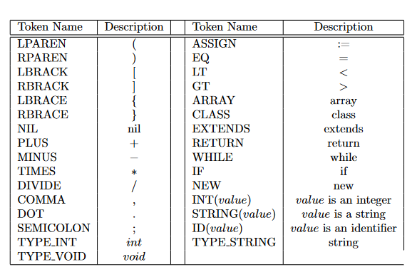

<a name="readme-top"></a>

<!-- PROJECT SHIELDS -->
[![Contributors][contributors-shield]][contributors-url]
[![Forks][forks-shield]][forks-url]
[![Stargazers][stars-shield]][stars-url]
[![Issues][issues-shield]][issues-url]
[![MIT License][license-shield]][license-url]
[![LinkedIn][linkedin-shield]][linkedin-url]

<!-- PROJECT LOGO -->
<br />
<div align="center">
    <a href="https://github.com/Boazius/TAU-Compilation-Project">
        
    </a>

<h3 align="center">Tel Aviv University Compilation Project</h3>

  <p align="center">
    Fully functional Compiler for a made up programming language called "L", to MIPS assembly. <br> Programmed using Java, Jflex, Java_cup. <br> Project made to run on linux.  <!-- TODO -->
    <br />
    <a href="https://github.com/Boazius/TAU-Compilation-Project/issues">Report Bug</a>
    ·
    <a href="https://github.com/Boazius/TAU-Compilation-Project/issues">Request Feature</a>
  </p>
</div>

<!-- TABLE OF CONTENTS TODO -->
<details>
  <summary>Table of Contents</summary>
  <ol>
    <li>
      <a href="#about-the-project">About The Project</a>
      <ul>
        <li><a href="#built-with">Built With</a></li>
      </ul>
    </li>
    <li>
      <a href="#getting-started">Getting Started</a>
      <ul>
        <li><a href="#prerequisites">Prerequisites</a></li>
        <li><a href="#installation">Installation</a></li>
      </ul>
    </li>
    <li><a href="#usage">Usage</a></li>
    <li><a href="#roadmap">Roadmap</a></li>
    <li><a href="#contributing">Contributing</a></li>
    <li><a href="#license">License</a></li>
    <li><a href="#contact">Contact</a></li>
    <li><a href="#acknowledgments">Acknowledgments</a></li>
  </ol>
</details>

<!-- ABOUT THE PROJECT -->
# About The Project
This repository contains a complete compiler for the "L" programming language, which translates "L" programs to MIPS assembly code. The project was developed as part of a compilation course at Tel Aviv University. It is structured into four exercises, each focusing on a distinct phase of the compilation process:

1. **Exercise 1 - Lexical Scanner**: Implementation of a JFlex-based lexical scanner for tokenizing the input program.
2. **Exercise 2 - CUP Based Parser**: Utilizes CUP to check the syntax and create an Abstract Syntax Tree (AST) for the input program.
3. **Exercise 3 - Semantic Analyzer**: Implements a recursive scan of the AST to detect and report any semantic errors.
4. **Exercise 4 - Code Generation**: Translates the enriched AST into MIPS assembly code, involving intermediate representation (IR) creation, translation to MIPS instructions, and register allocation.


**Each exercise has its dedicated folder within the repository (i.e ex1, ex2..), containing the source code and any relevant files**

# Exercise 1 - A lexical scanner based on JFlex.

The first exercise implements a lexical scanner for the "L" programming language using JFlex. The scanner is designed to tokenize an input "L" program and generate a tokenized representation of the input. 

## Specifications
The full specification can be found [Here](./ex1/ex1.pdf)

- **Identifiers:** May contain letters and digits and must start with a letter. Certain keywords cannot be used as identifiers, including: class, nil, array, while, int, extends, return, new, if, string.
- **Whitespace:** Consists of spaces, tabs, and newline characters and may appear between any tokens.
- **Comments:** Similar to C-style comments. Two types of comments are recognized: Type-1 comments (//...) and Type-2 comments (/*...*/). Unclosed Type-2 comments are considered lexical errors.
- **Integers:** Represented as sequences of digits. Leading zeroes are considered lexical errors. Limited to 16-bit signed values between 0 and $2^{15}$-1.
- **Strings:** Sequences of letters between double quotes. Strings containing non-letter characters are lexical errors. Unclosed strings are also considered lexical errors.

### Token Descriptions

The exercise defines various token names, including parentheses, brackets, braces, operators, keywords, integers, identifiers, strings, and types. The output format for each token includes the token name, line number, and character position inside that line, along with associated values where applicable.



## Input and Output

- **Input:** The input for this exercise is a single text file containing an "L" program.
- **Output:** A single text file that contains a tokenized representation of the input program. Each token appears on a separate line, along with the line number it appeared on and the character position inside that line. In case of any lexical error, the output file should contain the word "ERROR."


## Running the Lexical Scanner

To run the Lexical Scanner for the "L" programming language, please ensure that JFlex is set up properly on your Linux system (or WSL). You can follow the setup instructions provided in the next section before proceeding with the steps below.

### Instructions

1. Clone the repository to your local machine.
2. Navigate to the "ex1" directory within the repository.
3. Open a terminal window in this directory.

### Running the Program

In the terminal, run the following command:

```bash
make
```
This command performs the following steps:
- Generates the source code file src/Lexer.java based on the JFlex specifications.
- Compiles the modules into LEXER.
- Runs the LEXER on input/Input.txt
- outputs the result to output/OutputTokens.txt and to the terminal

# Exercise 2 - 


<p align="right">(<a href="#readme-top">back to top</a>)</p>

### Built With
<!-- Fill the relevant technologies shields here TODO -->
* [![Python][Python-shield]][Python-url]

<p align="right">(<a href="#readme-top">back to top</a>)</p>

<!-- GETTING STARTED -->
## Getting Started
<!-- TODO -->
This is an example of how you may give instructions on setting up your project locally.
To get a local copy up and running follow these simple example steps.

### Prerequisites
<!-- TODO -->
This is an example of how to list things you need to use the software and how to install them.

* npm

  ```sh
  npm install npm@latest -g
  ```

### Installation
<!-- TODO -->
1. Get a free API Key at [https://example.com](https://example.com)
2. Clone the repo

   ```sh
   git clone https://github.com/Boazius/TAU-Compilation-Project.git
   ```

3. Install NPM packages

   ```sh
   npm install
   ```

4. Enter your API in `config.js`

   ```js
   const API_KEY = 'ENTER YOUR API';
   ```

<p align="right">(<a href="#readme-top">back to top</a>)</p>

<!-- USAGE EXAMPLES -->
## Usage
<!-- TODO -->
Use this space to show useful examples of how a project can be used. Additional screenshots, code examples and demos work well in this space. You may also link to more resources.

_For more examples, please refer to the [Documentation](https://example.com)_

<p align="right">(<a href="#readme-top">back to top</a>)</p>

<!-- ROADMAP -->
## Roadmap
<!-- TODO -->
* [ ] Feature 1
* [ ] Feature 2
* [ ] Feature 3
  * [ ] Nested Feature

See the [open issues](https://github.com/Boazius/TAU-Compilation-Project/issues) for a full list of proposed features (and known issues).

<p align="right">(<a href="#readme-top">back to top</a>)</p>

<!-- CONTRIBUTING -->
## Contributing
<!-- TODO -->
Contributions are what make the open source community such an amazing place to learn, inspire, and create. Any contributions you make are **greatly appreciated**.

If you have a suggestion that would make this better, please fork the repo and create a pull request. You can also simply open an issue with the tag "enhancement".
Don't forget to give the project a star! Thanks again!

1. Fork the Project
2. Create your Feature Branch (`git checkout -b feature/AmazingFeature`)
3. Commit your Changes (`git commit -m 'Add some AmazingFeature'`)
4. Push to the Branch (`git push origin feature/AmazingFeature`)
5. Open a Pull Request

<p align="right">(<a href="#readme-top">back to top</a>)</p>

<!-- LICENSE -->
## License
<!-- TODO -->
Distributed under the MIT License. See `LICENSE.txt` for more information.

<p align="right">(<a href="#readme-top">back to top</a>)</p>

<!-- CONTACT -->
## Contact

### I can be reached at at my email: <boazyakubov@gmail.com>

<p align="right">(<a href="#readme-top">back to top</a>)</p>

<!-- ACKNOWLEDGMENTS -->
## Acknowledgments

* []()
* []()
* []()

<p align="right">(<a href="#readme-top">back to top</a>)</p>

<!-- MARKDOWN LINKS & IMAGES -->
<!-- You can get more shields at img.shields.io , usage: [![Python][Python-shield]][Python-url] -->
[contributors-shield]: https://img.shields.io/github/contributors/Boazius/TAU-Compilation-Project.svg?style=for-the-badge
[contributors-url]: https://github.com/Boazius/TAU-Compilation-Project/graphs/contributors
[forks-shield]: https://img.shields.io/github/forks/Boazius/TAU-Compilation-Project.svg?style=for-the-badge
[forks-url]: https://github.com/Boazius/TAU-Compilation-Project/network/members
[stars-shield]: https://img.shields.io/github/stars/Boazius/TAU-Compilation-Project.svg?style=for-the-badge
[stars-url]: https://github.com/Boazius/TAU-Compilation-Project/stargazers
[issues-shield]: https://img.shields.io/github/issues/Boazius/TAU-Compilation-Project.svg?style=for-the-badge
[issues-url]: https://github.com/Boazius/TAU-Compilation-Project/issues
[license-shield]: https://img.shields.io/github/license/Boazius/TAU-Compilation-Project.svg?style=for-the-badge
[license-url]: https://github.com/Boazius/TAU-Compilation-Project/blob/master/LICENSE.txt
[linkedin-shield]: https://img.shields.io/badge/-LinkedIn-black.svg?style=for-the-badge&logo=linkedin&colorB=555
[linkedin-url]: https://linkedin.com/in/boazyakubov
[product-screenshot]: images/screenshot.png
[Python-shield]: https://img.shields.io/badge/python-3670A0?style=for-the-badge&logo=python&logoColor=ffdd54
[Python-url]: https://www.python.org/