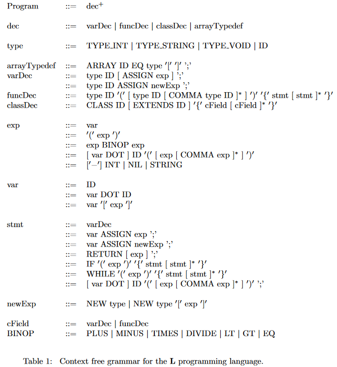
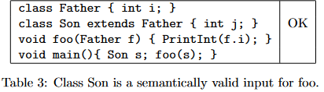
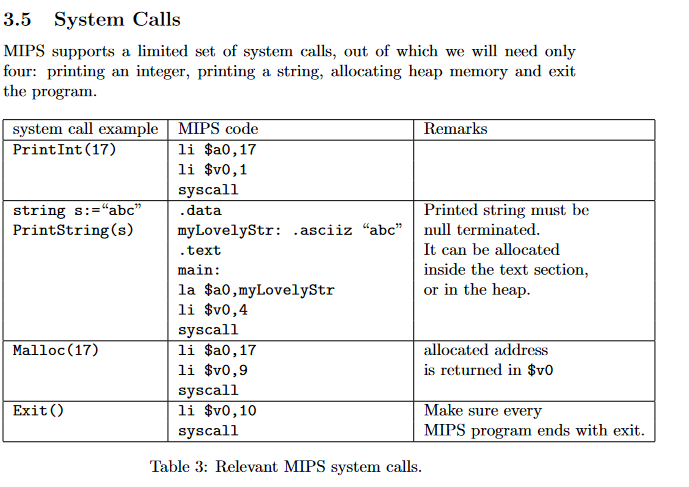

<a name="readme-top"></a>

<!-- PROJECT SHIELDS -->
[![Contributors][contributors-shield]][contributors-url]
[![Forks][forks-shield]][forks-url]
[![Stargazers][stars-shield]][stars-url]
[![Issues][issues-shield]][issues-url]
[![MIT License][license-shield]][license-url]
[![LinkedIn][linkedin-shield]][linkedin-url]

<!-- PROJECT LOGO -->
<br />
<div align="center">
    <a href="https://github.com/Boazius/TAU-Compilation-Project">
        
    </a>

<h3 align="center">Tel Aviv University Compilation Project</h3>

  <p align="center">
    Fully functional Compiler for a made up programming language called "L", to MIPS assembly. <br> Programmed using Java, Jflex, Java_cup. <br> Project made to run on linux.  <br> Created as part of the 2022 Compilation course in Tel Aviv University
    <br />
    <a href="https://github.com/Boazius/TAU-Compilation-Project/issues">Report Bug</a>
    ·
    <a href="https://github.com/Boazius/TAU-Compilation-Project/issues">Request Feature</a>
  </p>
</div>


<!-- ABOUT THE PROJECT -->
# About The Project
This repository contains a complete compiler for the "L" programming language, which translates "L" programs to MIPS assembly code. The project was developed as part of a compilation course at Tel Aviv University. It is structured into four exercises, each focusing on a distinct phase of the compilation process:

1. **Exercise 1 - Lexical Scanner**: Implementation of a JFlex-based lexical scanner for tokenizing the input program.
2. **Exercise 2 - CUP Based Parser**: Utilizes CUP to check the syntax and create an Abstract Syntax Tree (AST) for the input program.
3. **Exercise 3 - Semantic Analyzer**: Implements a recursive scan of the AST to detect and report any semantic errors.
4. **Exercise 4 - Code Generation**: Translates the enriched AST into MIPS assembly code, involving intermediate representation (IR) creation, translation to MIPS instructions, and register allocation.


**Each exercise has its dedicated folder within the repository (i.e ex1, ex2..), containing the source code and any relevant files**


<!-- GETTING STARTED -->
# Getting Started
To begin working on the compiler for the "L" language, follow the steps below for setting up your development environment.

### 1. Install WSL (Windows Subsystem for Linux)

If you are using Windows, it is recommended to set up the Windows Subsystem for Linux (WSL) to ensure a seamless development experience. You can follow the instructions [here](https://docs.microsoft.com/en-us/windows/wsl/install) to install WSL on your machine.

### 2. Install the necessary programs

Ensure that you have the Java Development Kit (JDK), make, jflex installed on your linux system.
you can use the following commands:
```
apt update
apt upgrade
apt install openjdk-19-jdk-headless (or some other jdk)
apt install jflex (this will also install CUP)
apt install make
```
you can check that it worked with:
```
java --version
javac --version
jflex --version
cup -version
make --version
```

now, you can use the wsl terminal in the repo folder to follow along the exercises:

<p align="right">(<a href="#readme-top">back to top</a>)</p>

<!--- Exercise 1 --->
# Exercise 1 - A lexical scanner based on JFlex.

The first exercise implements a lexical scanner for the "L" programming language using JFlex. The scanner is designed to tokenize an input "L" program and generate a tokenized representation of the input. 

## Specifications
The full specification can be found [Here](./ex1/ex1.pdf)

- **Identifiers:** May contain letters and digits and must start with a letter. Certain keywords cannot be used as identifiers, including: class, nil, array, while, int, extends, return, new, if, string.
- **Whitespace:** Consists of spaces, tabs, and newline characters and may appear between any tokens.
- **Comments:** Similar to C-style comments. Two types of comments are recognized: Type-1 comments (//...) and Type-2 comments (/*...*/). Unclosed Type-2 comments are considered lexical errors.
- **Integers:** Represented as sequences of digits. Leading zeroes are considered lexical errors. Limited to 16-bit signed values between 0 and $2^{15}$-1.
- **Strings:** Sequences of letters between double quotes. Strings containing non-letter characters are lexical errors. Unclosed strings are also considered lexical errors.

### Token Descriptions

The exercise defines various token names, including parentheses, brackets, braces, operators, keywords, integers, identifiers, strings, and types. The output format for each token includes the token name, line number, and character position inside that line, along with associated values where applicable.


## Input and Output

- **Input:** The input for this exercise is a single text file containing an "L" program.
- **Output:** A single text file that contains a tokenized representation of the input program. Each token appears on a separate line, along with the line number it appeared on and the character position inside that line. In case of any lexical error, the output file should contain the word "ERROR."

## Running the Lexical Scanner

To run the Lexical Scanner for the "L" programming language, please ensure that JFlex is set up properly on your Linux system (or WSL). You can follow the setup instructions provided in the next section before proceeding with the steps below.

## Instructions

1. Clone the repository to your local machine.
2. Navigate to the "ex1" directory within the repository.
3. Open a terminal window in this directory.

## Running the Program

In the terminal, run the following command:

```bash
make
```
This command performs the following steps:
- Generates the source code file src/Lexer.java based on the JFlex specifications.
- Compiles the modules into LEXER.
- Runs the LEXER on input/Input.txt
- outputs the result to output/OutputTokens.txt and to the terminal

<p align="right">(<a href="#readme-top">back to top</a>)</p>

<!---- Exercise 2 --->
# Exercise 2 - CUP Based Parser
The full specification can be found [Here](./ex2/ex2.pdf)

The second exercise involves implementing a CUP based parser for the "L" programming language, building upon the JFlex scanner from Exercise 1. The parser takes a single text file containing an "L" program as input and outputs a single text file indicating whether the input program is syntactically valid. Additionally, the parser internally creates an abstract syntax tree (AST) for the input program if the syntax is correct.

## L Syntax
The context-free grammar for the "L" programming language is specified here:


To ensure proper functionality, it's crucial to feed this grammar to CUP and resolve any potential shift-reduce conflicts. The operator precedence is outlined in Table 2:


## Input and Output

- **Input:** The input for this exercise is a single text file containing an "L" program.
- **Output:** A single text file that contains either "OK" when the input program has correct syntax, "ERROR(location)" when there is a syntax error (with location indicating the line number of the first encountered error), or "ERROR" when there is a lexical error.


## Instructions

1. Navigate to the "ex2" directory within the repository.
2. Open a terminal window in this directory.
3. run ```make``` as usual which:
   1. Generates the relevant files using jflex/cup
   2. Compiles the modules into PARSER
   3. Runs PARSER on input/Input.txt
   4. Generates an image of the resulting syntax tree (for debugging only)

The provided `ex2/Makefile` builds the parser into the `ex2/PARSER` directory. The `PARSER` can be executed via the command line with the following parameters:

```bash
java -jar PARSER <input_file_path> <output_file_path>
```

<p align="right">(<a href="#readme-top">back to top</a>)</p>

<!---- Exercise 3 --->
# Exercise 3 - Semantic Analyzer
The full specification can be found [Here](./ex3/ex3.pdf)

The third exercise involves implementing a semantic analyzer for the "L" programming language. The semantic analyzer recursively scans the Abstract Syntax Tree (AST) produced by the CUP parser from Exercise 2.

Its main goal is to check for any semantic errors within the program. The input for the semantic analyzer is a single text file containing an "L" program, and the output is a single text file indicating whether the input program is semantically valid. Furthermore, the semantic analyzer enriches the AST with metadata that will be utilized in later phases, such as code generation and optimization.

## L Semantics

The semantics of the "L" programming language are _quite complex_, and are outlined in the **full specification** in [the pdf](./ex3/ex3.pdf) - covering **types, classes, inheritance, arrays, assignments, if and while statements, return statements, equality testing, binary operations, and scope rules**..

for example:



## Input and Output

- **Input:** The input for this exercise is a single text file containing an "L" program.
- **Output:** A single text file that contains the word "OK" when the input program is correct semantically. In case of any semantic error, the output will contain "ERROR(location)", where "location" indicates the line number of the first encountered error.

## Instructions

1. Navigate to the "ex3" directory within the repository.
2. Open a terminal window in this directory.
3. run ```make``` as usual which 
   1. Generates the relevant files using jflex/cup
   2. Compiles the modules into COMPILER
   3. Generates an image of the resulting syntax tree
   4. Generates images which describe the changes in the symbol table

make has targets for 'debug' and 'compile', where compile doesn't generate the syntax tree and symbol table.

The makefile for this exercise is located at the following path: `ex3/Makefile`. This makefile will build the semantic analyzer into the `ex3/COMPILER` directory. You can run the COMPILER via the command line using the following parameters:

```bash
java -jar COMPILER <input_file_path> <output_file_path>
```

<p align="right">(<a href="#readme-top">back to top</a>)</p>

# Exercise 4 - Code Generation
The full specification can be found [Here](./ex4/ex4.pdf)

The fourth and final exercise entails implementing the code generation phase for "L" programs. The chosen destination language is MIPS assembly, known for its straightforward syntax, complete toolchain, and ample available tutorials.

SPIM is used to run the MIPS code that is generated using the L compiler.

### Runtime Checks

L enforces several runtime checks, including division by zero, invalid pointer dereference, and out-of-bound array access. The Specification provides guidelines on how to handle these scenarios effectively.

L will also utilize some system calls that MIPS supports:


for example in order to print "Illegal Division by Zero" where applicable, and exiting gracefully using Exit().

### Program Entry Point (main)

Every valid L program includes a main function that serves as the entry point of execution. The README provides information on the required signature and the function's role in the program's execution flow.

## Input and Output

- **Input:** The input for this exercise is a single text file containing an "L" program.
- **Output:** A single text file that contains the translation of the input program into MIPS assembly.

## Instructions

1. Navigate to the "ex4" directory within the repository.
2. Open a terminal window in this directory.
3. run ```make everything``` which 
   1. Generates the relevant files using jflex/cup
   2. Compiles the modules into COMPILER
   3. COMPILER then converts the input file into the output file containing MIPS code
   4. spim  runs on the MIPS code and outputs the result.

The makefile for this exercise is located at the following path: `ex3/Makefile`. This makefile will build the semantic analyzer into the `ex3/COMPILER` directory. You can run the COMPILER via the command line using the following parameters:

```bash
java -jar COMPILER <input_file_path> <output_file_path>
```

### Command-line Usage

The COMPILER is invoked via the command line using the following parameters:

```bash
java -jar COMPILER <input_file_path> <output_file_path>
```
<p align="right">(<a href="#readme-top">back to top</a>)</p>

## Built With
<!-- Fill the relevant technologies shields here TODO -->
* [![Java][Java-shield]][Java-url]
* Jflex
* Java CUP
* make
* A LOT of Coffee

<p align="right">(<a href="#readme-top">back to top</a>)</p>

<!-- CONTACT -->
## Contact

### I can be reached at at my email: <boazyakubov@gmail.com>

<p align="right">(<a href="#readme-top">back to top</a>)</p>

<!-- ACKNOWLEDGMENTS -->
## Acknowledgments

* [Professor Noam Rinetsky](https://www.tau.ac.il/profile/maon) - taught the course!
* [David Trabizh](https://www.tau.ac.il/profile/davivtra) - Instructed for this course
* Microsoft, for making WSL, VSCode, and many more tools i used during this course
* Students who took the course on 2022a - you made some great suggestions and i wouldnt have made it without you!
* Gerwin Klein and his team, who made jflex: https://www.jflex.de/
* Whoever made JAVA CUP at http://www2.cs.tum.edu/projects/cup/

<p align="right">(<a href="#readme-top">back to top</a>)</p>

<!-- LICENSE -->
## License
This work is licensed under the Creative Commons Attribution-NonCommercial-ShareAlike 4.0 International License.
refer to it here: [LICENSE.txt](/LICENSE.txt)
Basically, you can use/modify this repo as you see fit FOR EDUCATIONAL PURPOSES ONLY, and must give credit to the course instructors who made it.

The specifications and Compilation course content (The L language, ex1.pdf, ex2.pdf, ex3.pdf, ex4.pdf and every file) are the property of Tel Aviv University Compilation course staff of 2022, i do not own them in any way, and are only here for documentation's sake.

This repository was forked from https://github.com/davidtr1037/compilation-tau/

<p align="right">(<a href="#readme-top">back to top</a>)</p>


<!-- MARKDOWN LINKS & IMAGES -->
<!-- You can get more shields at img.shields.io , usage: [![Python][Python-shield]][Python-url] -->
[contributors-shield]: https://img.shields.io/github/contributors/Boazius/TAU-Compilation-Project.svg?style=for-the-badge
[contributors-url]: https://github.com/Boazius/TAU-Compilation-Project/graphs/contributors
[forks-shield]: https://img.shields.io/github/forks/Boazius/TAU-Compilation-Project.svg?style=for-the-badge
[forks-url]: https://github.com/Boazius/TAU-Compilation-Project/network/members
[stars-shield]: https://img.shields.io/github/stars/Boazius/TAU-Compilation-Project.svg?style=for-the-badge
[stars-url]: https://github.com/Boazius/TAU-Compilation-Project/stargazers
[issues-shield]: https://img.shields.io/github/issues/Boazius/TAU-Compilation-Project.svg?style=for-the-badge
[issues-url]: https://github.com/Boazius/TAU-Compilation-Project/issues
[license-shield]: https://img.shields.io/github/license/Boazius/TAU-Compilation-Project.svg?style=for-the-badge
[license-url]: https://github.com/Boazius/TAU-Compilation-Project/blob/master/LICENSE.txt
[linkedin-shield]: https://img.shields.io/badge/-LinkedIn-black.svg?style=for-the-badge&logo=linkedin&colorB=555
[linkedin-url]: https://linkedin.com/in/boazyakubov
[product-screenshot]: images/screenshot.png
[Python-shield]: https://img.shields.io/badge/python-3670A0?style=for-the-badge&logo=python&logoColor=ffdd54
[Python-url]: https://www.python.org/
[java-shield]: https://img.shields.io/badge/Java-ED8B00?style=for-the-badge&logo=openjdk&logoColor=white
[java-url]: https://www.java.com
